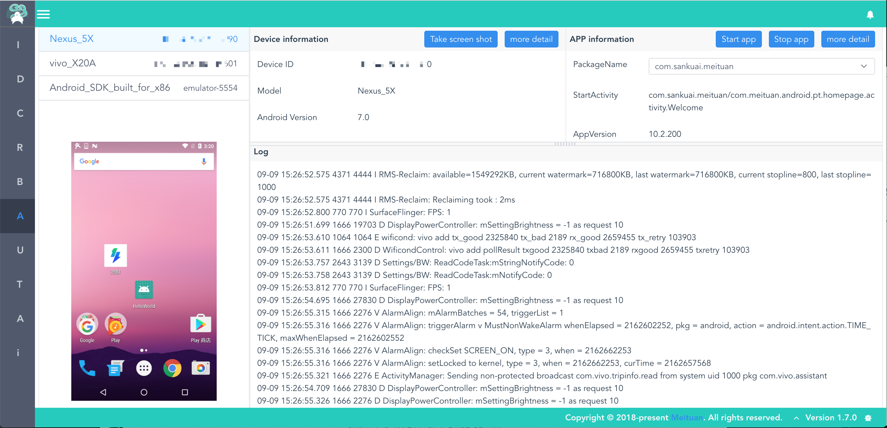

<p align="center"></p>
<h1 align="center">Lyrebird - Android plugin</h1>

[](https://travis-ci.org/Meituan-Dianping/lyrebird-android)
[](https://pypi.python.org/pypi/lyrebird-android)


**[Lyrebird](https://github.com/Meituan-Dianping/lyrebird)**
是一个基于拦截以及模拟HTTP/HTTPS网络请求的面向移动应用的插件化测试平台。

**Android plugin是一个Lyrebird的插件，用于从Android设备获取信息。**

----

# 快速开始

## 环境要求

* macOS

* Python3.6及以上

* 安装[AndroidSDK](https://developer.android.com/studio/)，并设置SDK环境变量 “ANDROID_HOME”

## 安装

```bash
pip3 install lyrebird-android
```

## 启动

```bash
lyrebird
```

## 使用

  使用时，通过USB线连接手机和电脑即可。



  连接设备并打开调试模式，左侧会展示出已接入的设备id。点击设备id可查看和操作选定的设备，详细包括：

  - 查看设备信息

  - 查看应用信息

  - 获取系统日志

  - 获取屏幕快照

  - 安装应用

  - 卸载应用

  - 清除应用缓存

  - 拉起应用

  - 关闭应用

----

# 开发者指南

## 开发环境

* macOS OR Linux

* Python3

* NodeJS

* vscode(推荐)

* Chrome(推荐)

## 配置Lyrebird-android工程

```bash
# clone 代码
git clone git@github.com:Meituan-Dianping/lyrebird-android.git

# 进入工程目录
cd lyrebird-android

# 初始化后端开发环境
python3 -m venv --clear venv

# 初始化前端开发环境
cd frontend
npm install
cd ..

# 使用IDE打开工程（推荐vscode）
code .
```

## 调试代码

### Vscode debug 配置
```JSON
{
    "version": "0.2.0",
    "configurations": [
        {
            "name": "backend",
            "type": "python",
            "request": "launch",
            "module": "lyrebird",
            "console": "integratedTerminal",
            "args": [
                "-vvv"
            ]
        },
        {
            "name": "frontend",
            "type": "chrome",
            "request": "launch",
            "url": "http://localhost:8080/ui/static/",
            "webRoot": "${workspaceFolder}/frontend/src/",
            "breakOnLoad": true,
            "sourceMapPathOverrides": {
              "webpack:///src/*": "${webRoot}/*"
            }
        }
    ]
}
```

### 后端代码

1. 激活python虚拟环境

    通过 ```source venv/bin/activate``` 来激活该环境

2. 通过Debug功能启动

    按照上面 debug配置中 python:Lyrebrid配置启动即可

### 前端代码

1. 启动node server

```bash
# 进入前端目录
cd frontend

# 启动前端node serve
npm run serve
```

2. 通过Debug功能启动浏览器

    按照上面 debug配置中 vuejs: chrome 配置启动即可

    > 注意: vscode 需要安装chrome debug插件
