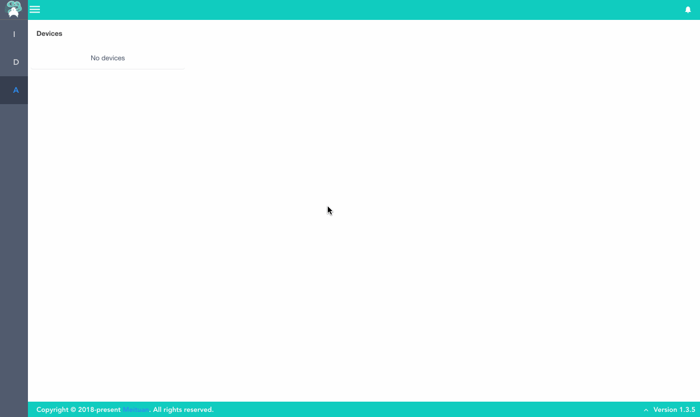
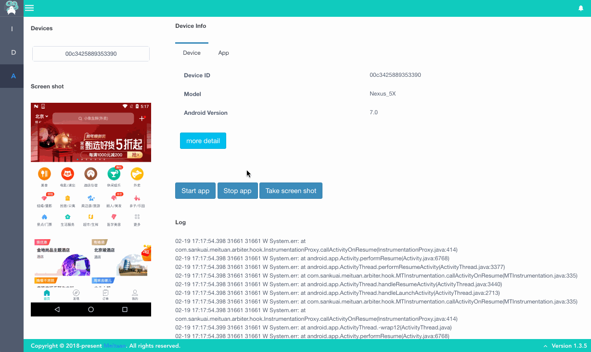
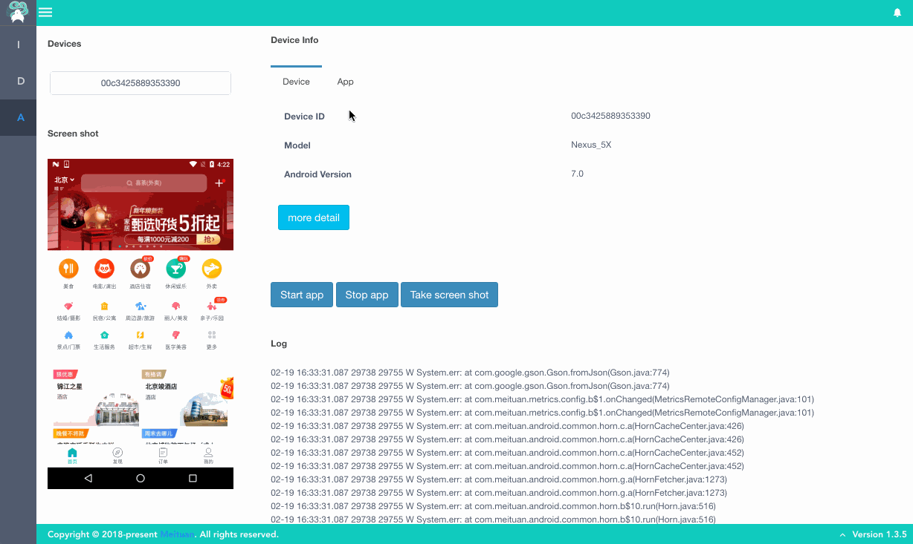
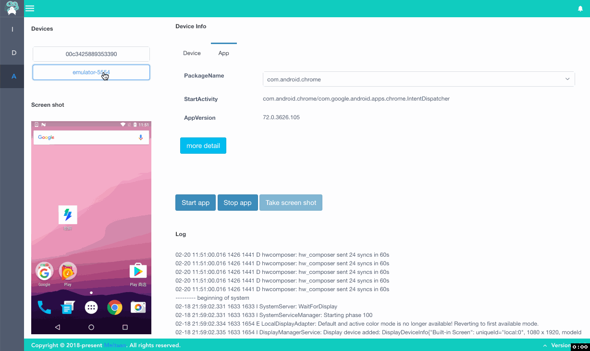

<p align="center"></p>
<h1 align="center">Lyrebird - Android plugin</h1>

[](https://travis-ci.org/Meituan-Dianping/lyrebird-android)
[](https://pypi.python.org/pypi/lyrebird-android)


**[Lyrebird](https://github.com/Meituan-Dianping/lyrebird)**
是一个基于拦截以及模拟HTTP/HTTPS网络请求的面向移动应用的插件化测试平台。

**Android plugin是一个Lyrebird的插件，用于从Android设备获取信息。**

----

# 快速开始

## 环境要求

* macOS

* Python3.6及以上

* 安装[AndroidSDK](https://developer.android.com/studio/)，并设置SDK环境变量 “ANDROID_HOME”

## 安装

```bash
pip3 install lyrebird-android
```

## 启动

```bash
lyrebird
```

## 使用

  使用时，通过USB线连接手机和电脑即可。

## 获取当前设备信息
连接设备并打开调试模式，左侧会展示出已接入的设备id。点击设备id可查看更多信息。


> more detail 可查看更多设备信息。

## 获取系统日志


## 获取指定应用信息


> more detail 可查看更多应用信息。

## 获取屏幕快照


## 拉起指定应用
如上图中的操作，选定应用后，可以通过Start app拉起改应用。

----

# 开发者指南

1. clone本项目

    ```bash
    git clone git@github.com:Meituan-Dianping/lyrebird-android.git
    ```

2. 进入项目目录
    
    ```bash
    cd lyrebird-android
    ```

3. 创建虚拟环境

    ```bash
    python3 -m venv venv
    ```

4. 安装依赖

    ```bash
    source venv/bin/activate
    pip3 install -r requirements.txt
    ```

5. 使用IDE打开工程（推荐[Pycharm](https://www.jetbrains.com/pycharm/)或[vscode](https://code.visualstudio.com/)）

6. debug启动应用

    使用 ./lyrebird_android/debug.py 启动
